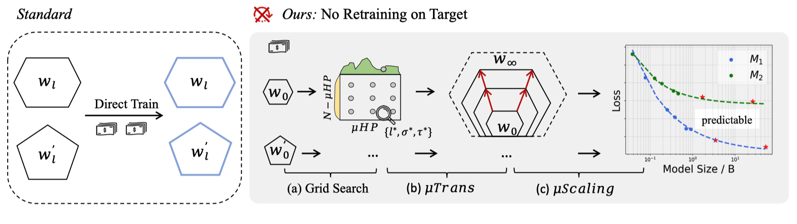

# NanoLM

## ✨ Introduction



We present an approach (namely **μScaling**) to predict the pre-training loss, based on our observations that Maximal Update Parametrization (μP) enables accurate fitting of scaling laws close to common loss basins in hyperparameter space. With μScaling, different model designs can be compared on large scales by training only their smaller counterparts. Further, we introduce **NanoLM**: an affordable LLM study benchmark that facilitates this new research paradigm. Our goal is to empower researchers to make meaningful comparisons between various model architectures and algorithms under limited computational resources. We will continue to develop NanoLM and welcome feedback from the community.


## 🛠️ Environment Setup

```
conda env create -f environment.yml
conda activate base
```

## 📚 Data Preparation
In our experiments, we used the C4 and mC4 datasets, and our pre-training code includes preprocessing for this format data.  We downloaded it from [huggingface C4 data](https://huggingface.co/datasets/c4),[huggingface mC4 data](https://huggingface.co/datasets/mc4). eg.,
```python
from datasets import load_dataset
dataset = load_dataset("c4")
```
Users can follow this data format to pre-train with other datasets, facilitating comparative analysis across different model designs using NanoLM.

We also curated and filtered pre-training datasets from existing large-scale models for researchers using NanoLM. Access the datasets at [NanoLM Data](https://huggingface.co/datasets/CofeAI/NanoData).
## 🏗️ Fast Usage


The process mainly involves three steps (refer to the intro image):
* step1: Perform a grid search with small-width models to find suitable μP parameters.
* step2: Transfer these μP parameters to larger-width models and pre-train them.
* step3: Obtain the loss for models at different widths and fit a power-law function $L=aC_t^b+c$

This ultimately enables accurate loss prediction for models at **any width at any time**! 
### Train your model with μScaling
NanoLM offers support for decoder-only structures (eg., GPT,Llama), encoder-only structures (eg., BERT), and encoder-decoder structures (eg., T5). We have incorporated steps 1 and 2 into a bash script. Users can pre-train small-width proxy models by running the following script:

#### decoder-only structures 

```
bash scripts/pretrain_gpt.sh
bash scripts/pretrain_llama.sh
```

#### encoder-only structures

```
bash scripts/pretrain_bert.sh
```

#### encoder-decoder structures 

```
bash scripts/pretrain_t5.sh
```

The training log will saved in ```./logs```, include **time step** and **loss**. According to [µP](https://arxiv.org/pdf/2203.03466), when the training steps surpass 5k, the µP transfer tend to stabilize. To this end, we suggest to fit the loss at >5k training step for more accurate prediction.

### Loss prediction

Use training loss from ```./logs``` under different width to fit scaling laws  for loss prediction.

```
python fit_loss.py
```

The coefficients a,b,c obtained by fitting the power-law function $L=aC_t^b+c$, according to the loss will be printed on the terminal. 


## Code

The training code is located in the ```/root/``` directory, specifically in ```pretrain_gpt.py```. Other model code can be found in the cofellm directory. Notably, the implementation of μP is in ```cofellm/model/gpt.py``` within the ```_init_all_weights_for_mup``` function, which is controlled by the ```config.use_mup```. 
Other model structure is similar.


# 🙏🏻 Acknowledgements

This project incorporates and modifies code from the following open-source repositories   [NanoGPT](https://github.com/karpathy/NanoGPT)  and [MuTransformers](https://github.com/microsoft/mutransformers). We extend our gratitude to the original authors for their innovative work and for making it available to the community.

## Citation
```
@misc{yao2024nanolm,
      title={nanoLM: an Affordable LLM Pre-training Benchmark via Accurate Loss Prediction across Scales}, 
      author={Yiqun Yao and Siqi fan and Xiusheng Huang and Xuezhi Fang and Xiang Li and Ziyi Ni and Xin Jiang and Xuying Meng and Peng Han and Shuo Shang and Kang Liu and Aixin Sun and Yequan Wang},
      year={2024},
      eprint={2304.06875},
      archivePrefix={arXiv},
      primaryClass={cs.CL}
}
```
